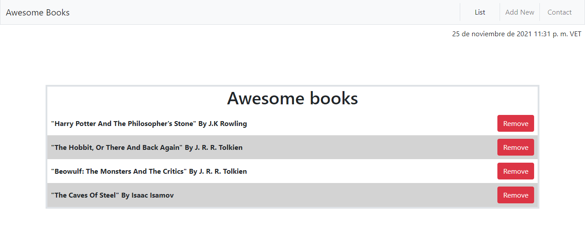

# Awesome Books

WebApp to add and remove book from list, as part of the Microverse Curriculum



## Built with

- HTML
- CSS
- Bootstrap
- JavaScript

### Prerequisites

- Web browser
- Visual Studio Code

### Setup

To get a local copy up and running follow these simple example steps.

Open terminal
Clone this project by command git clone https://github.com/kensayo/awesome-books.git
Open ```index.html``` in the browser (you can use Live Server extension in Visual Studio Code)

- Download/Clone the repository files and navigate to root folder 
- Open terminal and move to the root folder
- Run ´´´. code´´´ and run live server from VSCode
- Open your browser and go to [127.0.0.1](127.0.0.1)


## Authors

**👤 Kenny Ortega**

- GitHub: [kensayo](https://github.com/kensayo)
- Twitter: [@kensayo](https://twitter.com/kensayo)
- LinkedIn: [LinkedIn](https://www.linkedin.com/in/kennyortega/)

**👤 Miguel Angel Puentes**

- GitHub: [@mike2611](https://github.com/mike2611)
- Twitter: [@MiguelP2611](https://twitter.com/MiguelP2611)
- LinkedIn: [LinkedIn](https://linkedin.com/in/miguel-puentes-mata-90a562139/)


## 🤝 Contributing

Contributions, issues, and feature requests are welcome!

Feel free to check the [issues page](../../issues/).

## Show your support

Give a ⭐️ if you like this project!

## Acknowledgments

- [Microverse](https://www.microverse.org/)
- [The Odin Project](https://www.theodinproject.com/paths/full-stack-ruby-on-rails/courses/ruby-programming/lessons/bubble-sort)
